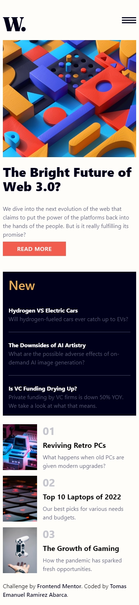

# Frontend Mentor - News homepage solution

This is a solution to the [News homepage challenge on Frontend Mentor](https://www.frontendmentor.io/challenges/news-homepage-H6SWTa1MFl). Frontend Mentor challenges help you improve your coding skills by building realistic projects. 

## Table of contents

- [Overview](#overview)
  - [The challenge](#the-challenge)
  - [Screenshot](#screenshot)
  - [Links](#links)
- [My process](#my-process)
  - [Built with](#built-with)
- [Author](#author)
- [Project Structure](#Project-Structure)

## Overview

### The challenge

Users should be able to:

- View the optimal layout for the interface depending on their device's screen size
- See hover and focus states for all interactive elements on the page

### Screenshot

#### Desktop


#### Mobile




### Links

- Live Site URL: [netlify](https://jovial-cannoli-b5c5f7.netlify.app/)

## My process

### Built with

- Semantic HTML5 markup
- [Tailwindcss](https://tailwindcss.com/docs/installation) - CSS Framework
- [ViteJs](https://vitejs.dev/)
- [React](https://reactjs.org/) - JS library
- [tailwindcss animated](https://www.tailwindcss-animated.com/) - Tailwindcss Plugin

## Author

- Github - [emanuel-ra](https://github.com/emanuel-ra/)
- Frontend Mentor - [@emanuel-ra](https://www.frontendmentor.io/profile/emanuel-ra)
- Linkedin - [@emanuelramirezabarca](https://www.linkedin.com/in/emanuelramirezabarca/)

## Project Structure
```
└── 📁news-homepage-main
    └── 📁App
        └── .eslintrc.cjs
        └── index.html
        └── package-lock.json
        └── package.json
        └── postcss.config.js
        └── 📁public
            └── vite.svg
        └── README.md
        └── 📁src
            └── App.jsx
            └── 📁assets
                └── 📁images
                    └── favicon-32x32.png
                    └── icon-menu-close.svg
                    └── icon-menu.svg
                    └── image-gaming-growth.jpg
                    └── image-retro-pcs.jpg
                    └── image-top-laptops.jpg
                    └── image-web-3-desktop.jpg
                    └── image-web-3-mobile.jpg
                    └── logo.svg
                └── images.js
                └── react.svg
            └── 📁components
                └── Card.jsx
                └── 📁icons
                    └── Logo.jsx
                    └── Menu.jsx
                    └── MenuClose.jsx
                └── Loading.jsx
                └── NavBar.jsx
                └── News.jsx
                └── Post.jsx
            └── index.css
            └── main.jsx
            └── 📁mooks
                └── navbar.js
                └── news.js
        └── tailwind.config.js
        └── vite.config.js
    └── 📁design
        └── active-states.jpg
        └── desktop-design.jpg
        └── desktop-preview.jpg
        └── mobile-design.jpg
        └── mobile-menu.jpg
    └── index.html
    └── README-template.md
    └── README.md
    └── 📁screenshot
        └── iPhone12Pro-1701838808944.jpeg
        └── MacbookPro-1701838727258.jpeg
    └── style-guide.md
```